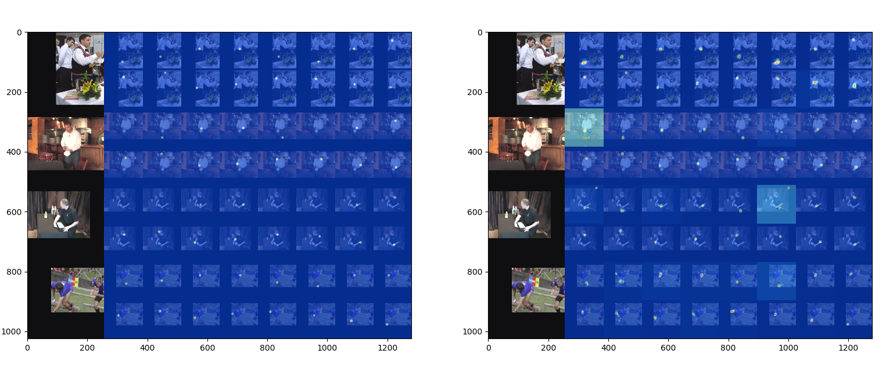

# Training Recipe

## Get datasets

### MPII Human Pose Dataset

- Download the [dataset](https://datasets.d2.mpi-inf.mpg.de/andriluka14cvpr/mpii_human_pose_v1.tar.gz) and create a link to the `images` directory at `./data/mpii/
images`
  ```
  ln -s ${MPII_PATH}/images ./data/mpii/images
  ```

- Download the [annotation file](https://drive.google.com/open?id=1mQrH_yVHeB93rzCfyq5kC9ZYTwZeMsMm) in our JSON format, and save it to `./data/mpii/mpii_annotations.json`

- You are good to go!


### COCO Keypoints 2014/2017

- Download datasets:
  ```
  cd ./data/mscoco
  wget http://images.cocodataset.org/zips/train2014.zip
  wget http://images.cocodataset.org/zips/val2014.zip
  wget http://images.cocodataset.org/zips/train2017.zip
  wget http://images.cocodataset.org/zips/val2017.zip
  unzip train2014.zip -d images
  unzip train2014.zip -d images
  unzip train2014.zip -d images
  unzip train2014.zip -d images
  rm -rf *.zip
  ```

  - Download the [coco_annotations_2014.json](https://drive.google.com/open?id=1jrxis4ujrLlkwoD2GOdv3PGzygpQ04k7) and [coco_annotations_2017.json](https://drive.google.com/open?id=1YuzpScAfzemwZqUuZBrbBZdoplXEqUse) in our JSON format, and save it to `./data/mscoco`

- You are good to go!

### Leeds Sports Pose (LSP)
- Download datasets:
  ```
  mkdir -p ./data/lsp/images
  cd ./data/lsp/images
  wget http://sam.johnson.io/research/lsp_dataset.zip
  wget http://sam.johnson.io/research/lspet_dataset.zip
  unzip lsp_dataset.zip -d lsp_dataset
  unzip lspet_dataset.zip -d lspet_dataset
  ```

  - Download the [LEEDS_annotations.json](https://drive.google.com/open?id=1GZxlTLuMfA3VRvz2jyv8fhJDqElNrgKS) in our JSON format, and save it to `./data/lsp`

- You are good to go!

## Training
- Example 1: Train from scratch - ECCV'16 8-stack hourglass network
```
CUDA_VISIBLE_DEVICES=0 python ./example/main.py \
--dataset mpii \
--arch hg \
--stack 8 \
--block 1 \
--features 256 \
--checkpoint ./checkpoint/mpii/hg-s8-b1
```

- Example 2: Train a much faster version of HG (e.g., 1-stack)
```
CUDA_VISIBLE_DEVICES=0 python ./example/main.py \
--dataset mpii \
--arch hg \
--stack 1 \
--block 1 \
--features 256 \
--checkpoint ./checkpoint/mpii/hg-s1-b1
```

- Example 3: Train on COCO 2014/2017 (set `--year` argument )
```
CUDA_VISIBLE_DEVICES=0 python ./example/main.py \
--dataset mscoco \
--year 2017 \
--arch hg \
--stack 1 \
--block 1 \
--features 256 \
--checkpoint ./checkpoint/mscoco/hg-s1-b1
```

- Example 4: resume training from a checkpoint
```
CUDA_VISIBLE_DEVICES=0 python ./example/main.py \
--dataset mpii \
--arch hg \
--stack 8 \
--block 1 \
--features 256 \
--checkpoint ./checkpoint/mpii/hg-s8-b1 \
--resume ./checkpoint/mpii/hg-s8-b1/checkpoint.pth.tar
```


- **Evaluation** from an existing model: use `-e`
```
CUDA_VISIBLE_DEVICES=0 python ./example/main.py \
--dataset mpii \
--arch hg \
--stack 8 \
--block 1 \
--features 256 \
--checkpoint ./checkpoint/mpii/hg-s8-b1 \
--resume ./checkpoint/mpii/hg-s8-b1/checkpoint.pth.tar \
-e
```

- **Debug**: Use `-d` if you want to visualize the keypoints with images
```
CUDA_VISIBLE_DEVICES=0 python ./example/main.py \
--dataset mpii \
--arch hg \
--stack 1 \
--block 1 \
--features 256 \
--checkpoint ./checkpoint/mpii/hg-s1-b1 \
--resume ./checkpoint/mpii/hg-s1-b1/checkpoint.pth.tar \
-e \
-d
```

The visualized images should be like


